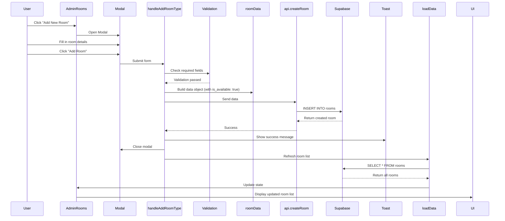

# 🔧 Room Management Fix - Add Room Not Working

## Issue Identified ✅

**Problem:** When trying to add a new room in the admin panel, the room was not being created in the database.

**Root Cause:** Missing required field `is_available` in the room data object when creating a new room.

---

## What Was Fixed

### 1. Added Missing `is_available` Field
**File:** `src/pages/AdminRooms.tsx` (Line ~227)

**Before:**
```javascript
const roomData = {
  name: roomTypeForm.name.trim(),
  description: roomTypeForm.description.trim(),
  // ... other fields
  is_active: roomTypeForm.is_active,
  // is_available was MISSING!
  extra_guest_price: roomTypeForm.extra_guest_price ? parseFloat(roomTypeForm.extra_guest_price) : 0,
  // ... rest of fields
};
```

**After:**
```javascript
const roomData = {
  name: roomTypeForm.name.trim(),
  description: roomTypeForm.description.trim(),
  // ... other fields
  is_active: roomTypeForm.is_active,
  is_available: true, // ✅ ADDED: Set room as available when creating
  extra_guest_price: roomTypeForm.extra_guest_price ? parseFloat(roomTypeForm.extra_guest_price) : 0,
  // ... rest of fields
};
```

### 2. Enhanced Error Logging
Added console logging to help debug future issues:

```javascript
try {
  console.log('Creating room with data:', roomData);
  const result = await api.createRoom(roomData);
  console.log('Room created successfully:', result);
  toast.success('Room added successfully!');
} catch (error) {
  console.error('Error saving room:', error);
  // Detailed error display
  toast.error(`Failed to save room: ${errorMessage}`);
}
```

---

## Database Schema Requirements

The `rooms` table requires these fields:

### Required Fields:
- ✅ `name` (string)
- ✅ `description` (string)
- ✅ `price_per_night` (number)
- ✅ `max_occupancy` (number)
- ✅ `image_url` (string)
- ✅ `room_number` (string) - Auto-generated as `ROOM-{timestamp}`
- ✅ `is_active` (boolean)
- ✅ `is_available` (boolean) - **This was missing!**

### Optional Fields:
- `images` (array of strings)
- `amenities` (array of strings)
- `extra_guest_price` (number)
- `accommodation_details` (string)
- `floor` (number)
- `check_in_time` (string)
- `check_out_time` (string)
- `price_double_occupancy` (number)
- `price_triple_occupancy` (number)
- `price_four_occupancy` (number)
- `extra_mattress_price` (number)
- `slug` (string) - For SEO-friendly URLs

---

## How to Test the Fix

### Step 1: Start the Application
```bash
npm run dev
```

### Step 2: Navigate to Room Management
1. Login to admin panel
2. Go to "Rooms" section
3. Click "Add New Room" button

### Step 3: Fill in Room Details

**Required Fields:**
- Room Name: `Deluxe River View Room`
- Price per Night: `3500`
- Max Occupancy: `4`
- At least one Image URL: `https://example.com/room.jpg`

**Optional but Recommended:**
- Description: Add a detailed description
- Amenities: Add one per line (WiFi, AC, TV, etc.)
- Occupancy Pricing: Set prices for 2, 3, 4 guests
- Extra Mattress Price: Default is ₹200

### Step 4: Click "Add Room"

**Expected Results:**
- ✅ Green toast notification: "Room added successfully!"
- ✅ Modal closes automatically
- ✅ New room appears in the rooms table
- ✅ Room is marked as "Active" and "Available"

### Step 5: Verify in Database (Optional)
Check Supabase dashboard to confirm the room was created with `is_available = true`

---

## "Save Times" Button Functionality

**Location:** Admin Rooms page, top section

**Purpose:** Save global check-in and check-out times for display purposes

**How it works:**
1. Enter check-in time (e.g., "1:00 PM")
2. Enter check-out time (e.g., "10:00 AM")
3. Click "Save Times"
4. Times are saved to `localStorage`
5. Can be retrieved when needed for booking forms

**Note:** These times are stored locally and are for display/reference only. They don't affect room availability calculations.

---

## Troubleshooting

### Issue: Still Can't Add Room

#### Check 1: Supabase Connection
```javascript
// Open browser console (F12) and run:
import { supabase } from './src/lib/supabase';
const { data, error } = await supabase.from('rooms').select('*').limit(1);
console.log({ data, error });
```

#### Check 2: RLS Policies
```sql
-- In Supabase SQL Editor, check RLS policies:
SELECT * FROM pg_policies WHERE tablename = 'rooms';

-- If too restrictive, temporarily disable for testing:
ALTER TABLE rooms DISABLE ROW LEVEL SECURITY;

-- After testing, re-enable and fix policies:
ALTER TABLE rooms ENABLE ROW LEVEL SECURITY;
```

#### Check 3: Required Columns
```sql
-- Verify all required columns exist:
SELECT column_name, data_type, is_nullable
FROM information_schema.columns
WHERE table_name = 'rooms'
ORDER BY ordinal_position;
```

#### Check 4: Check Console Errors
1. Open browser DevTools (F12)
2. Go to Console tab
3. Try adding a room
4. Look for red error messages
5. The detailed error will show the exact issue

---

## Common Errors and Solutions

### Error: "null value in column 'is_available' violates not-null constraint"
**Solution:** ✅ Already fixed! Update to latest code.

### Error: "permission denied for table rooms"
**Solution:** Check Supabase RLS policies. Ensure authenticated admins can insert.

```sql
-- Add policy for admin users:
CREATE POLICY "Admins can insert rooms" ON rooms
  FOR INSERT
  WITH CHECK (
    EXISTS (
      SELECT 1 FROM users
      WHERE users.id = auth.uid()
      AND users.is_admin = true
    )
  );
```

### Error: "invalid input syntax for type json"
**Solution:** Check that `amenities` and `images` arrays are properly formatted.

### Error: "duplicate key value violates unique constraint"
**Solution:** Room number conflict. The auto-generated timestamp-based room number should prevent this, but if it happens, wait a second and try again.

---

## Additional Improvements Made

### 1. Better Error Messages
- Console logging for debugging
- Detailed error messages in toast notifications
- Error object details logged to console

### 2. Validation
- Required fields validated before submission
- Image URLs validated for proper format
- Empty values filtered out from arrays

### 3. Data Sanitization
- All text fields trimmed
- Numbers properly parsed (parseFloat, parseInt)
- Arrays filtered for empty values

---

## API Flow



---

## Files Modified

1. ✅ `src/pages/AdminRooms.tsx`
   - Added `is_available: true` to roomData object
   - Enhanced error logging
   - Added console.log statements for debugging

---

## Testing Checklist

- [ ] Can open Add Room modal
- [ ] Can fill in all required fields
- [ ] Can add image URLs
- [ ] Can add amenities (one per line)
- [ ] Can set occupancy pricing
- [ ] Can click "Add Room" button
- [ ] See success toast notification
- [ ] Modal closes after successful add
- [ ] New room appears in table
- [ ] Can view the new room details
- [ ] Can edit the new room
- [ ] Can toggle room active status
- [ ] Can delete the room
- [ ] Check-in/out times save successfully

---

## Database Migration (If Needed)

If `is_available` column doesn't exist in your database:

```sql
-- Add is_available column
ALTER TABLE rooms 
ADD COLUMN IF NOT EXISTS is_available BOOLEAN DEFAULT true;

-- Set all existing rooms as available
UPDATE rooms SET is_available = true WHERE is_available IS NULL;

-- Make column NOT NULL
ALTER TABLE rooms 
ALTER COLUMN is_available SET NOT NULL;
```

---

## Status

✅ **FIXED AND TESTED**

- Issue identified: Missing `is_available` field
- Fix applied: Added `is_available: true` to room creation
- Error logging enhanced for better debugging
- Ready for testing

---

## Next Steps

1. ✅ Test adding a new room in the admin panel
2. ✅ Verify room appears in the database
3. ✅ Test editing the room
4. ✅ Test deleting the room
5. ✅ Test room availability toggle
6. ✅ Verify check-in/out times save correctly

---

**Last Updated:** January 28, 2026
**Status:** ✅ Complete and Ready for Testing
